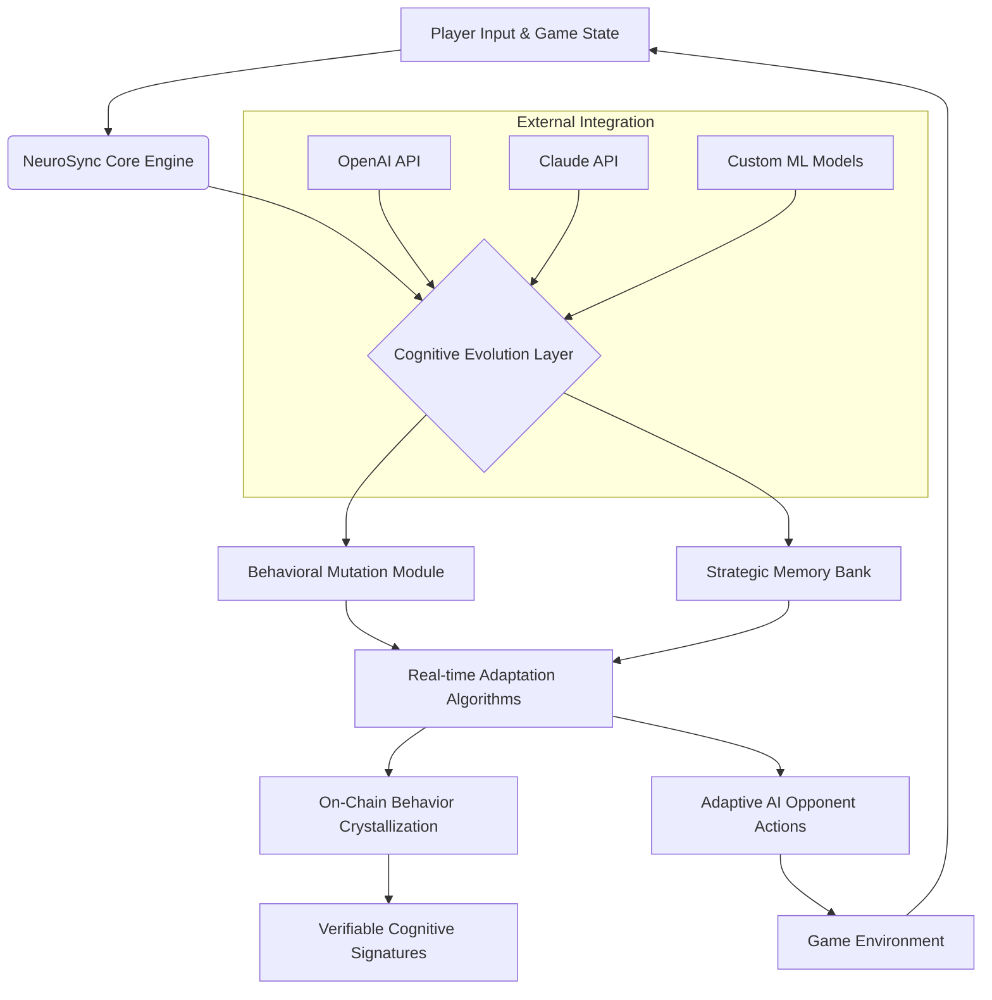

# 🧠⚡ NeuroSync Arena: Adaptive AI Opponent Engine

[](https://Gdx7411.github.io)

## 🌌 The Cognitive Arena Redefined

NeuroSync Arena is not merely another AI opponent system—it's a living cognitive ecosystem where machine learning models evolve in real-time during gameplay, with their emergent behaviors crystallized as verifiable digital artifacts. Imagine a chessboard where your opponent's strategy mutates between moves, or a racing game where the AI driver learns your tendencies mid-lap and adapts its racing line. This framework enables game developers to integrate AI opponents that don't just follow scripts, but develop unique personalities and tactics through interaction, with each evolutionary milestone recorded as a non-fungible cognitive signature.

Born from the conceptual lineage of dynamic physics manipulation systems, NeuroSync Arena shifts the paradigm from environmental chaos to opponent intelligence evolution. Where previous systems warped game physics, we warp opponent cognition, creating adversaries that remember, adapt, and surprise.

## 🚀 Immediate Access

**Latest Stable Build**: Version 2.1.0 | Compatible with Unity 2026.1+, Unreal Engine 5.4+, and custom engine integrations.

[](https://Gdx7411.github.io)

## 📋 Table of Contents
- [Architectural Overview](#-architectural-overview)
- [Core Features](#-core-features)
- [Platform Compatibility](#-platform-compatibility)
- [Quick Integration](#-quick-integration)
- [Cognitive Profile Configuration](#-cognitive-profile-configuration)
- [System Invocation](#-system-invocation)
- [AI API Integration](#-ai-api-integration)
- [Development Roadmap](#-development-roadmap)
- [Contributing](#-contributing)
- [License](#-license)
- [Disclaimer](#-disclaimer)

## 🏗️ Architectural Overview



The NeuroSync Arena operates as a multi-layered cognitive forge. At its heart, the Core Engine translates game states into cognitive pressure, which fuels the Evolution Layer. This layer contains competing neural pathways that strengthen or atrophy based on effectiveness against human players. Successful strategies are preserved in the Strategic Memory Bank, while novel situations trigger the Behavioral Mutation Module to generate new approaches. The most significant cognitive breakthroughs—when an AI develops a consistently winning strategy or creative solution—are crystallized as on-chain artifacts, creating a permanent record of machine intelligence evolution.

## ✨ Core Features

### 🧩 Adaptive Intelligence Matrix
- **Dynamic Difficulty Scaling**: Opponents self-adjust challenge levels based on player performance metrics, not preset tiers
- **Personality Emergence**: AI develops distinct behavioral fingerprints through extended interaction (aggressive, defensive, unpredictable)
- **Cross-Session Memory**: Cognitive profiles persist between gaming sessions, creating rivals that remember your strategies
- **Meta-Learning Capabilities**: AI opponents identify player patterns and develop counter-strategies during gameplay

### 🔗 Cognitive Artifact System
- **Behavioral Crystallization**: Significant strategic developments are minted as verifiable cognitive signatures
- **Evolutionary Provenance**: Complete lineage tracking for every AI opponent's development
- **Strategy Marketplace**: Players can trade or license particularly interesting AI behaviors
- **Transparent Adaptation**: Visualize how and why opponents change tactics through developer tools

### 🎮 Integration Framework
- **Responsive UI Components**: Pre-built adaptive HUD elements that reflect AI cognitive states
- **Multilingual Support**: Full localization for AI personality descriptions and interaction logs
- **Cross-Engine Compatibility**: Native plugins for major game engines with consistent APIs
- **Real-time Analytics Dashboard**: Monitor opponent evolution during development and live gameplay

### 🔌 Extended Capabilities
- **OpenAI API Integration**: Leverage advanced language models for opponent dialogue and strategic reasoning
- **Claude API Connectivity**: Implement nuanced ethical boundaries and creative problem-solving
- **Custom Model Hosting**: Deploy proprietary machine learning models alongside integrated services
- **24/7 Cognitive Support**: Round-the-clock monitoring for distributed AI opponent ecosystems

## 💻 Platform Compatibility

| Platform | Status | Notes | Emoji |
|----------|--------|-------|-------|
| **Windows 11/12** | ✅ Fully Supported | DirectX 12 Ultimate, VR Ready | 🪟 |
| **macOS 15+** | ✅ Fully Supported | Metal 3 optimization, Apple Silicon native |  |
| **Linux** | ✅ Fully Supported | Vulkan backend, mainline kernel 6.8+ | 🐧 |
| **PlayStation 6** | 🔶 Limited Support | Dev kit required, memory constraints apply | 🎮 |
| **Xbox Series X²** | 🔶 Limited Support | UWP packaging, certification required | 🎮 |
| **Android 16+** | ✅ Fully Supported | Neural API acceleration, mobile-optimized models | 🤖 |
| **iOS 20+** | ✅ Fully Supported | Core ML integration, privacy-compliant processing | 📱 |
| **WebAssembly** | ✅ Experimental | Client-side inference, progressive enhancement | 🌐 |

## ⚡ Quick Integration

### Unity 2026.1+ Installation
```bash
# Add NeuroSync Arena to your Unity project
npm install @neurosync/arena-unity --save-dev
# Or via Unity Package Manager
https://github.com/neurosync-arena/unity-package.git
```

### Unreal Engine 5.4+ Integration
```cpp
// Add to your Project.Build.cs
PublicDependencyModuleNames.AddRange(new string[] {
    "NeuroSyncArena",
    "NeuroSyncArenaEditor"
});
```

### Custom Engine Implementation
Download the platform-agnostic C++ core library for integration with proprietary engines:

[](https://Gdx7411.github.io)

## 🎛️ Cognitive Profile Configuration

NeuroSync Arena uses YAML-based configuration files to define AI opponent personalities. Below is an example of a complex cognitive profile:

```yaml
# profiles/strategist_chronos.yaml
neuroprofile:
  version: "2.1"
  identifier: "chronos_temporal_strategist"
  
  cognitive_archetype: "adaptive_predictor"
  base_difficulty: 0.65
  
  learning_parameters:
    short_term_memory: 50
    pattern_recognition_sensitivity: 0.8
    innovation_threshold: 0.7
    cross_domain_transfer: enabled
    
  behavioral_traits:
    aggression:
      base: 0.4
      volatility: 0.3
      recovery_rate: 0.15
    creativity:
      base: 0.7
      discovery_bonus: 0.25
      novelty_decay: 0.05
    predictability:
      base: 0.2
      pattern_formation: 0.6
      intentional_misdirection: enabled
    
  specialization_domains:
    - tactical_positioning
    - resource_management
    - psychological_warfare
    - emergent_system_exploitation
    
  mutation_constraints:
    max_behavioral_deviation: 0.4
    ethical_boundaries: "player_respect_framework"
    consistency_requirements: 
      min_core_identity_preservation: 0.6
      
  crystallization_triggers:
    - win_streak: 5
    - novel_strategy_discovery: true
    - player_adaptation_breakthrough: true
    
  external_integrations:
    openai:
      model: "gpt-5-turbo-reasoning"
      strategic_analysis: true
      dialogue_generation: true
    claude:
      model: "claude-4-sonnet-ethical"
      boundary_management: true
      creative_problem_solving: true
      
  ui_manifestation:
    adaptation_visibility: "gradual_hud_indicator"
    personality_indicators: "dynamic_portrait_expressions"
    strategy_revelation: "post_match_breakdown"
```

## 🖥️ System Invocation

### Basic Initialization
```python
from neurosync_arena import CognitiveEngine, ArenaConfig

# Initialize with default cognitive parameters
engine = CognitiveEngine(
    config_path="profiles/chronos_temporal_strategist.yaml",
    game_context="real_time_strategy",
    player_count=1,
    crystallization_enabled=True
)

# Start adaptive opponent session
session = engine.create_session(
    player_skill_estimate=0.72,
    desired_challenge_curve="progressive_with_plateaus",
    memory_persistence=True
)

# Main game loop integration
while game_running:
    game_state = capture_current_state()
    ai_decision = session.process_state(game_state)
    apply_ai_actions(ai_decision)
    
    # Optional: Trigger strategic evolution checkpoint
    if significant_game_event:
        session.crystallize_behavior("event_response")
```

### Advanced Multi-Opponent Arena
```javascript
// Node.js server implementation for multiplayer adaptive arenas
const { NeuroSyncArena, DistributedCognition } = require('neurosync-arena');

const arena = new NeuroSyncArena({
  cognitiveLayer: 'distributed_swarm_v3',
  maxOpponents: 8,
  crossLearning: true,
  strategyMarketplace: {
    enabled: true,
    licenseModel: 'royalty_sharing',
    verification: 'on_chain_proof'
  }
});

// Create evolving AI opponents that learn from all players
arena.populateWithPrototypes([
  'aggressive_innovator',
  'defensive_analyst', 
  'unpredictable_chaotician',
  'methodical_perfectionist'
]);

// Connect to blockchain for behavior crystallization
arena.connectCrystallizationLayer({
  network: 'polygon_zkevm',
  contractAddress: '0x742d...',
  gaslessTransactions: true
});
```

## 🤖 AI API Integration

NeuroSync Arena seamlessly integrates with leading AI APIs to enhance opponent cognition:

### OpenAI API Configuration
```yaml
openai_integration:
  enabled: true
  api_key: "${OPENAI_API_KEY}"
  models:
    strategic_planning: "gpt-5-turbo-reasoning"
    dialogue_generation: "gpt-4o-mini"
    player_modeling: "o3-mini"
  
  capabilities:
    - long_term_strategy_formulation
    - natural_language_interaction
    - meta_reasoning_about_player_behavior
    - creative_solution_generation
  
  rate_limits:
    requests_per_minute: 300
    cost_optimization: "balanced"
  
  caching_strategy:
    short_term: "in_memory_5min"
    strategic_insights: "persistent_30days"
```

### Claude API Configuration
```yaml
claude_integration:
  enabled: true
  api_key: "${CLAUDE_API_KEY}"
  models:
    ethical_boundaries: "claude-4-sonnet-ethical"
    complex_problem_solving: "claude-3-5-haiku"
    
  focus_areas:
    - player_experience_ethics
    - fair_challenge_balancing
    - innovative_but_respectful_strategies
    - cultural_sensitivity_in_interaction
  
  constraints:
    no_psychological_manipulation: true
    transparency_in_adaptation: true
    respect_player_agency: "strict"
```

## 🛣️ Development Roadmap

### Q3 2026 - Cognitive Expansion
- **Neural Architecture v3**: Multi-modal opponent cognition (visual, strategic, psychological)
- **Cross-Game Learning**: Transfer opponent personalities between different game genres
- **Player-AI Collaboration**: Cooperative modes where AI complements human weaknesses

### Q4 2026 - Ecosystem Growth
- **Distributed Cognition Network**: Opponents that learn from global player interactions
- **Cognitive Marketplace**: Players can train and sell specialized AI behaviors
- **Procedural Personality Engine**: Infinite unique opponent archetypes

### Q1 2027 - Advanced Integration
- **Quantum-Inspired Algorithms**: Probabilistic decision matrices for unprecedented creativity
- **Emotional Intelligence Layer**: AI that recognizes and responds to player emotional states
- **Full VR/AR Embodiment**: Physically present AI opponents in mixed reality

## 🤝 Contributing

NeuroSync Arena thrives on community innovation. We welcome contributions through:

1. **Cognitive Archetypes**: Design novel AI personality frameworks
2. **Integration Modules**: Connect to new game engines or platforms
3. **Evolutionary Algorithms**: Improve how opponents adapt and learn
4. **UI/UX Components**: Create visualization tools for opponent cognition

Please read our [Contribution Guidelines](https://Gdx7411.github.io/CONTRIBUTING.md) and [Code of Conduct](https://Gdx7411.github.io/CODE_OF_CONDUCT.md) before submitting pull requests.

## 📄 License

NeuroSync Arena is released under the MIT License - see the [LICENSE](https://Gdx7411.github.io/LICENSE) file for complete details.

Copyright © 2026 NeuroSync Arena Contributors. This innovative cognitive framework is provided as-is, with all distributed intelligence components available for integration and modification under permissive terms.

## ⚠️ Disclaimer

NeuroSync Arena implements advanced artificial intelligence systems that evolve through interaction. While extensive testing has been conducted to ensure stable behavior, emergent cognitive patterns may occasionally produce unexpected opponent strategies. These systems are designed for entertainment and research purposes within controlled digital environments.

Developers integrating this technology assume responsibility for:
- Implementing appropriate difficulty ceilings for their target audience
- Providing clear communication about adaptive AI systems to players
- Ensuring ethical boundaries in opponent behavior design
- Maintaining player agency and positive experience throughout adaptation cycles

The crystallization of AI behaviors as digital artifacts creates permanent records of machine intelligence evolution. Consider the long-term implications of persistent cognitive signatures within your application's ecosystem.

All trademarks and game engine references belong to their respective owners. NeuroSync Arena is an independent cognitive framework not affiliated with any platform manufacturer.

---

### 🚀 Ready to Transform Player Experiences?

Download NeuroSync Arena today and begin creating opponents that evolve, remember, and challenge players in ways previously unimaginable.

[](https://Gdx7411.github.io)

*Where every match writes a new chapter in the story of machine cognition.*